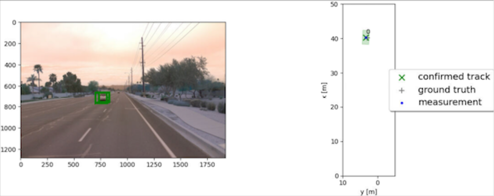

# Writeup: Track 3D-Objects Over Time

This is the final project of sensor fusion and object tracking. There are four main steps: Step 1: Implement an extended Kalman filter. Step 2: Implement track management including track state and track score, track initialization and deletion. Step 3: Implement single nearest neighbour data association and gating. Step 4: Apply sensor fusion by implementing the nonlinear camera measurement model and a sensor visibility check.

RMSE is used to quantify the performance of the object detection and tracking performance. The plots of RMSE and tracking video are in /student/Figures_Videos

### 1. Write a short recap of the four tracking steps and what you implemented there (filter, track management, association, camera fusion). Which results did you achieve? Which part of the project was most difficult for you to complete, and why?

## Step 1: Extended Kalman Filter

EKF is implemented and applied to a simple single-target scenario with lidar only. The constant velocity model is used to develop the system matrix and process matrix F and process nosie Q. EKF is applied to a simple single-target scenario with lidar only. The following figures are tracking and RMSE measurement RMSE results. 

## Step 2: Track Management
The track management is implemented, which includings initializing and deleting the tracks and setting a track state and a track score for the track object. The track state is initialized with 'initialized' and the score with 1./params.window. The track scores ire decreased for the unassigned tracks. The track is deleted if the score is too low or P is too big. After implementing the track management, a new track is initialized automatically where unassigned measurements occur, the true track is confirmed quickly, and the track is deleted after it has vanished from the visible range. The following plot is the RMSE results.

## Step 3: Data Association
A single nearest neighbor data association is implemented to associate measurements to tracks, which is based on minimizing Mahalanobis distance of detected objects to tracks. Gating is used to check if a measurement falls inside a track's gate. Multiple tracks are updated with multiple measurements. Each measurement is used at most once and each track is updated at most once. The following plot is RMSE results. The 

## Step 4: Association
A nonlinear camera measurement model and a linear lidar model is implemented.A method that checks whether an object can be seen by the camera or is outside the field of view is implemented. There are no confirmed ghosts or lost tracks. The following figure is the RMSE results

The data association is the most challenge part during the implementation. When there are many measurements and detected objects, the situation can become very complex. 

### 2. Do you see any benefits in camera-lidar fusion compared to lidar-only tracking (in theory and in your concrete results)? 

### 3. Which challenges will a sensor fusion system face in real-life scenarios? Did you see any of these challenges in the project?

### 4. Can you think of ways to improve your tracking results in the future?

